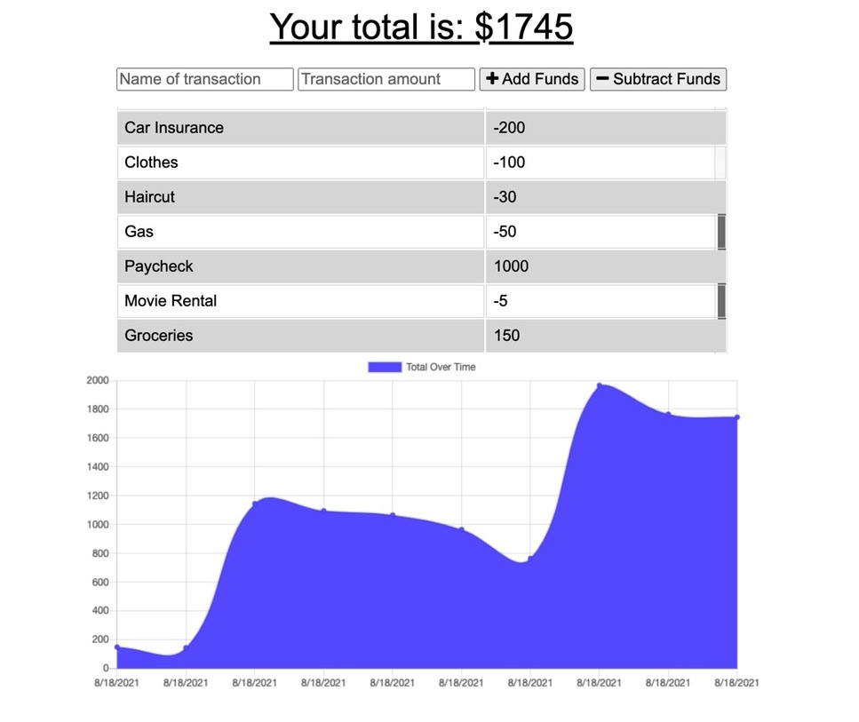

# Progressive-Budget

## Description

* Utilizing the Progressive Web App (PWA),the user will be able to add expenses and deposits to their budget with or without a connection. When entering transactions offline, they should populate the total when brought back online.

## Table of Contents
* [User Story](#userstory)
* [Installation](#installation)
* [Usage](#usage)
* [Questions](#questions)

<h2>User Story</h2>

*   AS AN avid traveller,
I WANT to be able to track my withdrawals and deposits with or without a data/internet connection,
SO THAT my account balance is accurate when I am traveling

<h2>Installation</h2>

* The user can clone the repo from GitHub. 
* Run `npm i` to install dev dependencies.
* Open a new terminal window and run `mongod` for the db.
* Then in your previous terminal, run `npm start` to start up the server.

<h2>Usage</h2>

* Check out the deployed version of the app on Heroku [Here](https://desolate-everglades-17776.herokuapp.com/) 

<h2>Questions</h2>

* If you have any questions, please feel free to contact me @ tyler.hance@gmail.com or visit my repo for additional projects @ https://github.com/tylerhance.